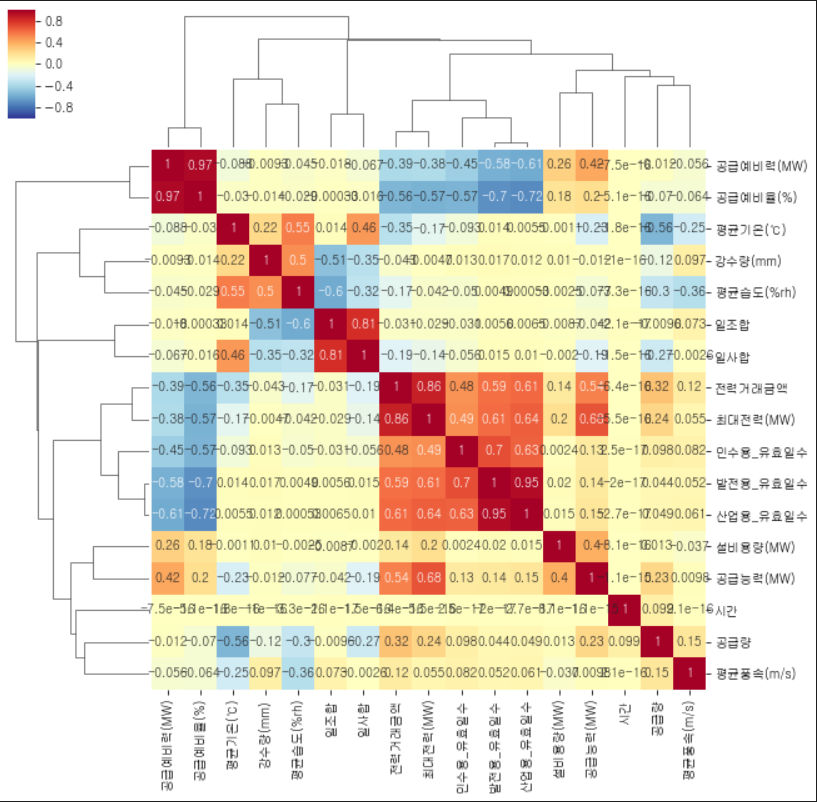
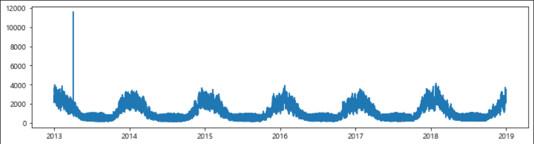
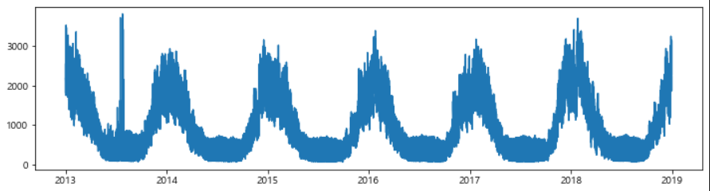
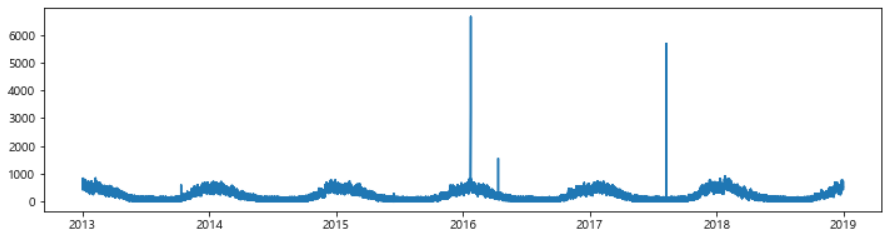
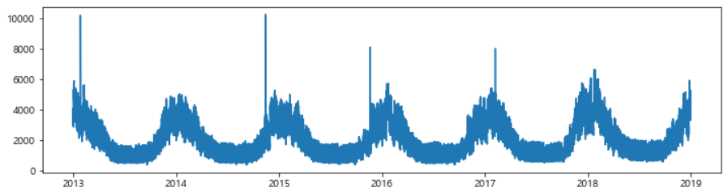
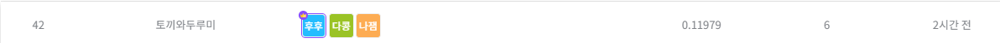

<div>
 <h2>
  
**2021가스 공급량 수요예측 모델 개발(DACON CHALLENGE)**
 </h2>

<br>

__토끼와 두루미팀 : 황다빈, [하지민](https://github.com/jimnida), [이채훈](https://github.com/commanderk9826/DACON_Project/)__

<br>
<h1>

📃 **분석개요**
</h1>
<h4>

- 시간별 공급량 데이터를 Base로, 외부데이터(기상청, 한국가스공사 등)을 활용하려고 하였으나 공급량과의 상관관계가 낮아 외부데이터 제외 <br>

- 시간별 데이터로 할 수 있는 방법론은 크게 시계열분석, 다변량 회귀 등이 있어 모든 방법을 시도해 보기로 함.
 
- 시계열 분석으로는 VAR, LSTM과 같은 다변량 시계열 분석을 진행하였으나, score가 너무 낮게 나왔음.<br>

- ARIMA 시계열 분석을 진행하려고 하였으나 추세성, 계절성, 차분 과정에서 적합하지 않다고 판단됨.<br>

- Fbprophet 라이브러리를 활용해 시계열 분석을 진행하였고, 1차 제출해 0.13056의 점수를 얻음.<Br>

- 이후 다변량 회귀 분석 방법인 Decision Tree, Random Forest, XGBoost 등의 방법을 사용

 - 최종적으로 score가 가장 높았던 RandomForest Regressor를 분석방법으로 선택함.<br>


</h4>
<div align='center'>

<br>

**<외부데이터를 활요한 상관관계 히트맵>**


</h3>
</div>
<br>
<h1>

**📃 개발 환경**
</h1>

**OS**
<br> 
Windows-10-10.0.22000-SP0
<br>

**Python version**
<br>
 3.8.10 (default, May 19 2021, 13:12:57) [MSC v.1916 64 bit (AMD64)]
<br>

<h3>

**Library version**
</h3>

**matplotlib**=3.3.4=py38haa95532_0
<br>

**numpy**=1.21.0=pypi_0
<br>

**pandas**=1.3.4=py38h6214cd6_0
<br>


**scikit-learn**=1.0.1=py38hf11a4ad_0
<br>

**scipy**=1.7.0=pypi_0
<br>

**seaborn**=0.11.1=pyhd3eb1b0_0
<br>

**sklearn**=0.0=pypi_0
<br>
<br>

<h1>

**📃 분석 과정**
</h1>

**STEP0 EDA를 통한 이상치 확인 및 전처리**
<br>

A, B, G, H 공급사의 공급량 데이터에 이상치가 존재하여, EDA를 통해 확인 후 결측치 처리한 뒤, 
```python
total.fillna(method='bfill', inplace=True)
```
결측치 데이터를 그 이전의 값으로 채우는 
**'bfill method'**
적용하여 이상치 처리
<br>
<br>

**A 공급사(이상치 처리 전)**<br>


<br>

**B 공급사(이상치 처리 전)**
<br>


<br>

**H 공급사(이상치 처리 전)**
<br>


<br>

**G 공급사(이상치 처리 전)**
<br>


**STEP1 TRAIN, VALIDATION DATASET 분할**

훈련에 사용할 **train set(2013~2017)**, 
<br> 
점수 확인을 위한 **validation set(2018)** 
분할 
```python
train_years = [2013,2014,2015,2016,2017]
val_years = [2018]

train = total[total['year'].isin(train_years)]
val = total[total['year'].isin(val_years)]
```

**STEP2 최적 파라미터로 모델 훈련 및 검증**<br>

```python
rf = RandomForestRegressor(
max_depth = 16, min_samples_split = 13, 
min_samples_leaf = 6, 
n_estimators = 30, 
random_state = 1234)

rf.fit(train_x, train_y)
```

**STEP3 TEST DATASET 예측 및 결과 제출**<br>
모델에 실제 데이터를 입력하기 위해서, 실제 훈련 데이터 생성 및 TARGET 데이터 예측
<br>
```python
# 실제 훈련을 위한 데이터 생성
train_all_years = [2013,2014,2015,2016,2017,2018]
train_all = total[total['year'].isin(train_all_years)]
features = ['구분', 'month', 'day', 'weekday', '시간']
train_xx = train_all[features]
train_yy = train_all['공급량']

rf = RandomForestRegressor(
max_depth = 16, min_samples_split = 13, 
min_samples_leaf = 6, 
n_estimators = 30, 
random_state = 1234)

rf.fit(train_xx, train_yy)
```

<h2>

**Final Score : 0.11979**
</h2>
<br>
</div>


