<div>
 <h2> 

 __가스 공급량 수요예측 모델 개발(DACON CHALLENGE)__   
 </h2>

<br>

__토끼와 두루미팀 : 황다빈, 하지민, 이채훈__

<br>
<h1>

📃 **분석개요**
</h1>
<h4>

- 시간별 공급량 데이터를 Base로, 외부데이터(기상청, 한국가스공사 등)을 활용하려고 하였으나 공급량과의 상관관계가 낮아 외부데이터 제외 <br>

- 시간별 데이터로 할 수 있는 방법론은 크게 시계열분석, 다변량 회귀 등이 있어 모든 방법을 시도해 보기로 함.
 
- 시계열 분석으로는 VAR, LSTM과 같은 다변량 시계열 분석을 진행하였으나, score가 너무 낮게 나왔음.<br>

- ARIMA 시계열 분석을 진행하려고 하였으나 추세성, 계절성, 차분 과정에서 적합하지 않다고 판단됨.<br>

- Fbprophet 라이브러리를 활용해 시계열 분석을 진행하였고, 1차 제출해 0.13056의 점수를 얻음.<Br>

- 이후 다변량 회귀 분석 방법인 Decision Tree, Random Forest, XGBoost 등의 방법을 사용

 - 최종적으로 score가 가장 높았던 RandomForest Regressor를 분석방법으로 선택함.<br>


</h4>
<div align='center'>
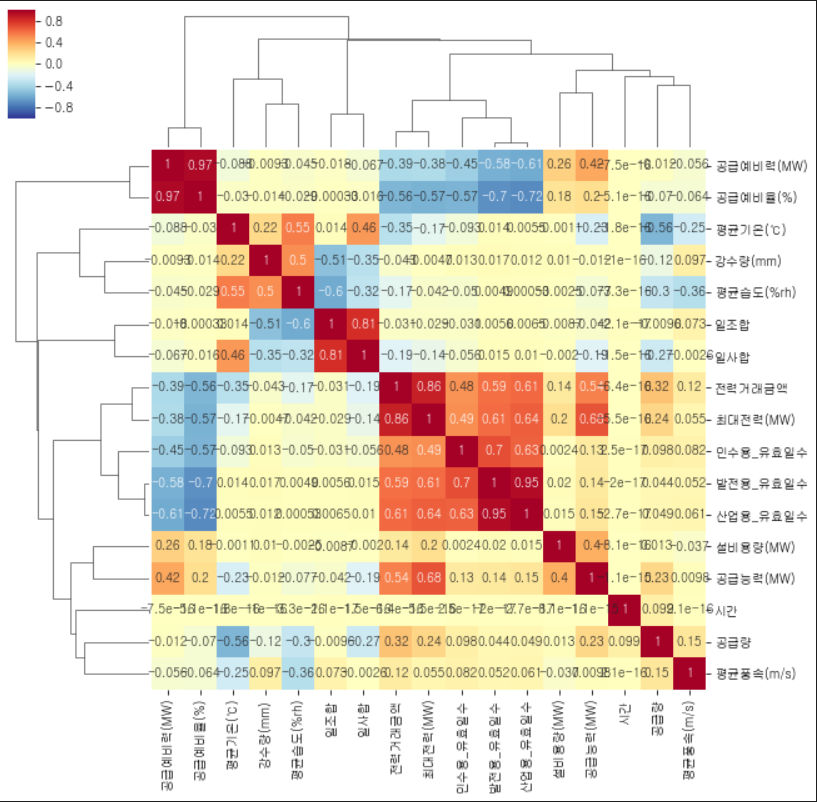
<br>

**<외부데이터를 활요한 상관관계 히트맵>**


</h3>
</div>
<br>
<h1>

**📃 개발 환경**
</h1>

**OS**
<br> 
Windows-10-10.0.22000-SP0
<br>

**Python version**
<br>
 3.8.10 (default, May 19 2021, 13:12:57) [MSC v.1916 64 bit (AMD64)]
<br>

<h3>

**Library version**
</h3>

**matplotlib**=3.3.4=py38haa95532_0
<br>

**numpy**=1.21.0=pypi_0
<br>

**pandas**=1.3.4=py38h6214cd6_0
<br>


**scikit-learn**=1.0.1=py38hf11a4ad_0
<br>

**scipy**=1.7.0=pypi_0
<br>

**seaborn**=0.11.1=pyhd3eb1b0_0
<br>

**sklearn**=0.0=pypi_0
<br>
<br>

<h1>

**📃 분석 과정**
</h1>

**STEP0 EDA를 통한 이상치 확인 및 전처리**
<br>

A, B, G, H 공급사의 공급량 데이터에 이상치가 존재하여, EDA를 통해 확인 후 결측치 처리한 뒤, 
```python
total.fillna(method='bfill', inplace=True)
```
결측치 데이터를 그 이전의 값으로 채우는 
**'bfill method'**
적용하여 이상치 처리
<br>
<br>

**A 공급사(이상치 처리 전)**<br>
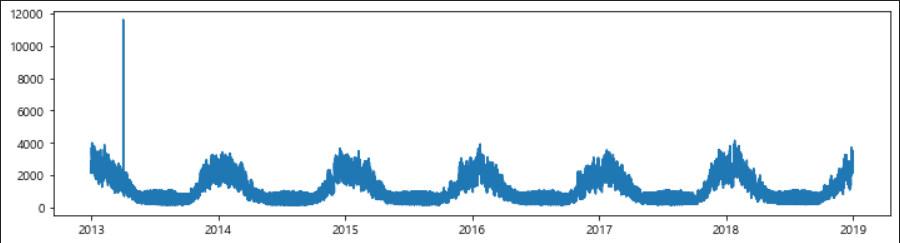

<br>

**B 공급사(이상치 처리 전)**
<br>
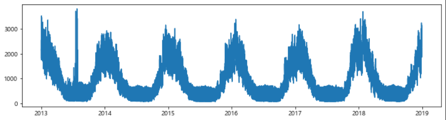

<br>

**H 공급사(이상치 처리 전)**
<br>
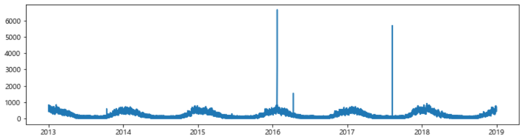

<br>

**G 공급사(이상치 처리 전)**
<br>
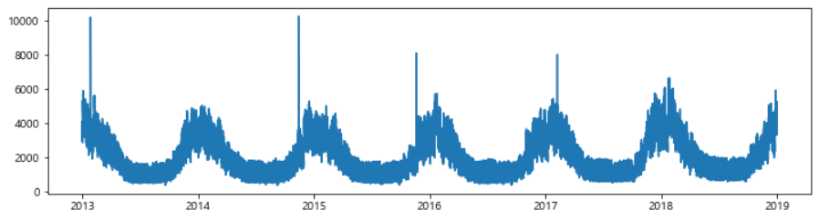

**STEP1 TRAIN, VALIDATION DATASET 분할**

훈련에 사용할 **train set(2013~2017)**, 
<br> 
점수 확인을 위한 **validation set(2018)** 
분할 
```python
train_years = [2013,2014,2015,2016,2017]
val_years = [2018]

train = total[total['year'].isin(train_years)]
val = total[total['year'].isin(val_years)]
```

**STEP2 파라미터 설정**

**n_estimators**<br> 
랜덤 포레스트에 들어가는 의사결정나무 개수를 설정  
여러 트리 모델의 결과를 선형 결합해 최종 모델을 만드는데 트리 개수를 감소시키면 일반적으로 과대 적합 방지  
과대적합 방지를 위해 트리 수는 **30**
으로 선택

```python
# train 및 val 설명력 결과 저장
train_score = []
val_score = []

# n_estimators : 트리 수 변경
para_n_tree = [n_tree * 10 for n_tree in range(1, 11)]

for v_n_estimators in para_n_tree:
    rf = RandomForestRegressor(n_estimators = v_n_estimators, random_state = 1234)
    rf.fit(train_x, train_y)
    train_score.append(rf.score(train_x, train_y))
    val_score.append(rf.score(val_x, val_y))

# 결과 저장
df_score_n = pd.DataFrame()
df_score_n["n_estimators"] = para_n_tree
df_score_n["TrainScore"] = train_score
df_score_n["ValScore"] = val_score

# 모델 설명력 확인
df_score_n.round(3)
```

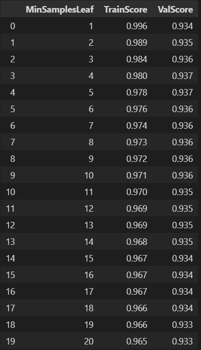

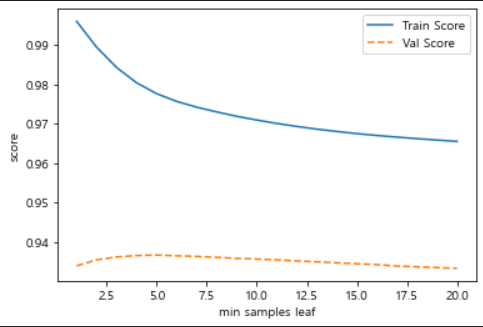

```python
# 과대적합 방지를 위해 트리 수는 30으로 선택
n_estimators = 30
```
<br>

**min_samples_leaf**<br>
최소 자료 수를 증가시키면 분리 조건이 엄격해져 과대적합이 방지됨  
하지만 잎사귀 노드 최소 자료 수 증가에 따라 모델의 설명력은 감소  
val데이터 정확도 변화를 고려해 **6** 선택

```python
# train 및 val 설명력 결과 저장
train_score = []
val_score = []

# min_samples_leaf : 잎사귀 최소 자료 수
para_leaf = [n_leaf for n_leaf in range(1, 21)]

for v_min_samples_leaf in para_leaf:
    rf = RandomForestRegressor(n_estimators = 30, random_state = 1234,
                                min_samples_leaf = v_min_samples_leaf)
    rf.fit(train_x, train_y)
    train_score.append(rf.score(train_x, train_y))
    val_score.append(rf.score(val_x, val_y))

# 결과 저장
df_score_leaf = pd.DataFrame()
df_score_leaf["MinSamplesLeaf"] = para_leaf
df_score_leaf["TrainScore"] = train_score
df_score_leaf["ValScore"] = val_score

# 모델 설명력 확인
df_score_leaf.round(3)
```
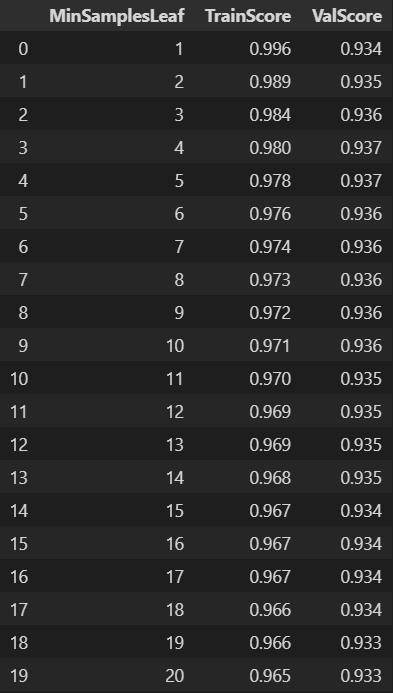

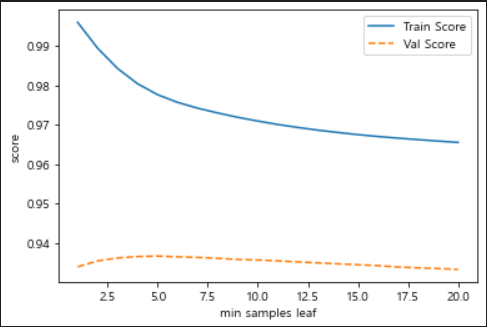

```python
# 잎사귀 노드 최소 자료 수 증가에 따라 설명력은 감소, 
# val데이터 정확도 변화를 고려해 6 선택
min_samples_leaf = 6
```
<br>

**min_samples_split**<br>
분리 노드 최소 자료 수 증가에 따라 모델의 설명력은 감소  
train/val 데이터 성능 변화를 고려해 **13** 선택

```python
# train 및 val 설명력 결과 저장
train_score = []
val_score = []

# min_samples_split : 분할하기 위한 노드 최소 자료 수
para_split = [n_split*2 for n_split in range(2, 21)]

for v_min_samples_split in para_split:
    rf = RandomForestRegressor(n_estimators = 30, random_state = 1234,
                                min_samples_leaf = 6,
                                min_samples_split = v_min_samples_split)
    rf.fit(train_x, train_y)
    train_score.append(rf.score(train_x, train_y))
    val_score.append(rf.score(val_x, val_y))

# 결과 저장
df_score_split = pd.DataFrame()
df_score_split["MinSamplesSplit"] = para_split
df_score_split["TrainScore"] = train_score
df_score_split["ValScore"] = val_score

# 모델 설명력 확인
df_score_split.round(3)
```
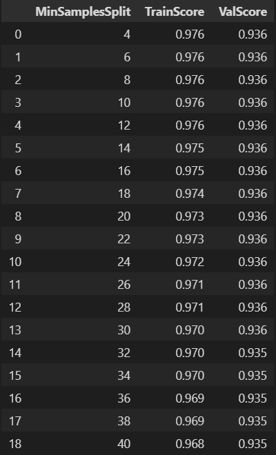

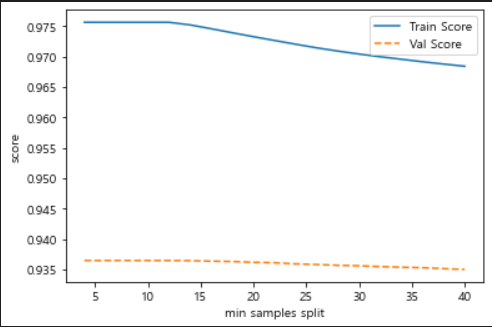

```python
# 분리 노드 최소 자료 수 증가에 따라 모델의 설명력 감소, 
# train/val 데이터 성능 변화를 고려해 13 선택
min_samples_split = 13
```

**max_depth**<br>
최대 깊이를 감소시키면 깊이 제약으로 과대적합이 방지됨  
최대 깊이 증가에 따라 모델의 설명력은 증가하며 train/val 데이터의 정확도 변화를 고려해 **16** 선택
```python
# train 및 val 설명력 결과 저장
train_score = []
val_score = []

# max_depth : 최대 깊이 변경
para_depth = [depth for depth in range(1, 21)]
for v_max_depth in para_depth:
    rf = RandomForestRegressor(n_estimators = 30, random_state = 1234,
                                min_samples_leaf = 6, min_samples_split = 13,
                                max_depth = v_max_depth)
    rf.fit(train_x, train_y)
    train_score.append(rf.score(train_x, train_y))
    val_score.append(rf.score(val_x, val_y))

# 결과 저장
df_score_depth = pd.DataFrame()
df_score_depth["Depth"] = para_depth
df_score_depth["TrainScore"] = train_score
df_score_depth["ValScore"] = val_score

# 모델 설명력 확인
df_score_depth.round(3)
```
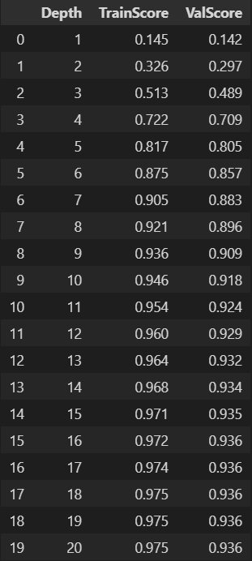

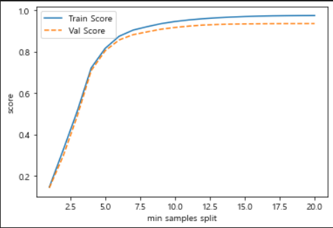

```python
# 분리 노드 최소 자료 수 증가에 따라 모델의 설명력 감소, 
# train/val 데이터 성능 변화를 고려해 16 선택
max_depth = 16
```

**STEP3 최적 파라미터로 모델 훈련 및 검증**<br>
STEP2에서 선정한 파라미터들로 모델 훈련 및 검증 진행

```python
rf = RandomForestRegressor(
max_depth = 16, min_samples_split = 13, 
min_samples_leaf = 6, 
n_estimators = 30, 
random_state = 1234)

rf.fit(train_x, train_y)
```


**STEP4 TEST DATASET 예측 및 결과 제출**<br>
모델에 실제 데이터를 입력하기 위해서, 실제 훈련 데이터 생성 및 TARGET 데이터 예측
<br>
```python
# 실제 훈련을 위한 데이터 생성
train_all_years = [2013,2014,2015,2016,2017,2018]
train_all = total[total['year'].isin(train_all_years)]
features = ['구분', 'month', 'day', 'weekday', '시간']
train_xx = train_all[features]
train_yy = train_all['공급량']

rf = RandomForestRegressor(
max_depth = 16, min_samples_split = 13, 
min_samples_leaf = 6, 
n_estimators = 30, 
random_state = 1234)

rf.fit(train_xx, train_yy)
```
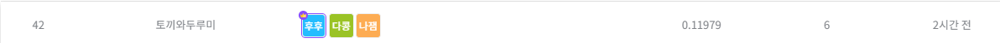
<h2>

**Final Score : 0.11979**
</h2>
<br>
</div>


